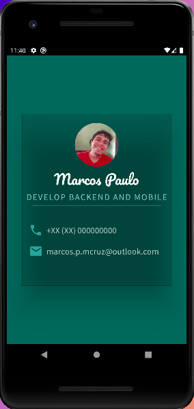

# Projeto Meu Cartão

### Nesse projeto aprendi o uso de algumas classes como:
* Container
* SizedBox
* EdgeInsets
* CircleAvatar
* Icon

Aprendi o uso de __children__  para colocar varios widget em uma estrutura,
além de saber usar os layout em Row ou "Column"

## O projeto final ficou assim

